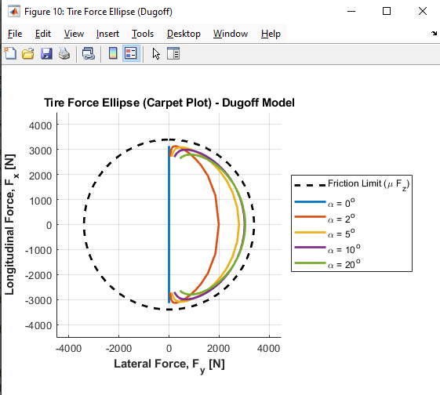
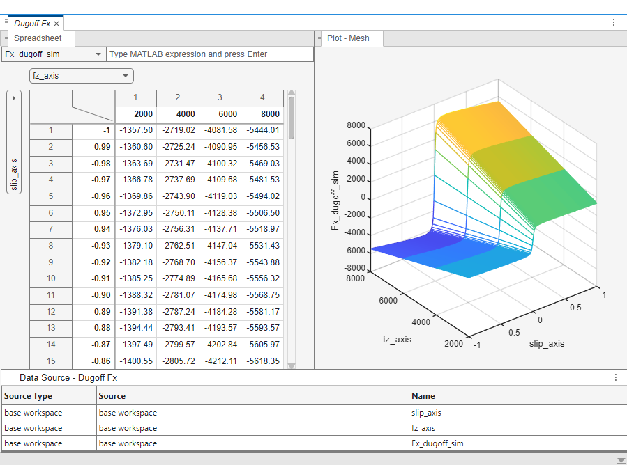
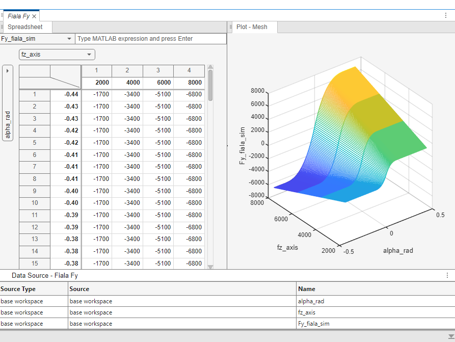
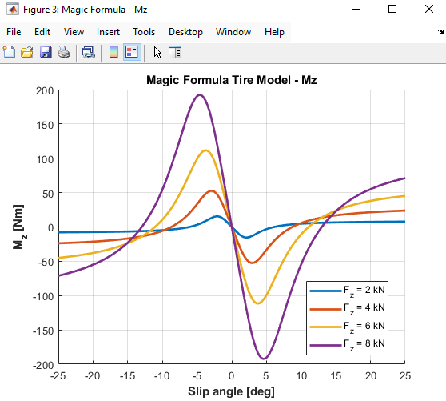
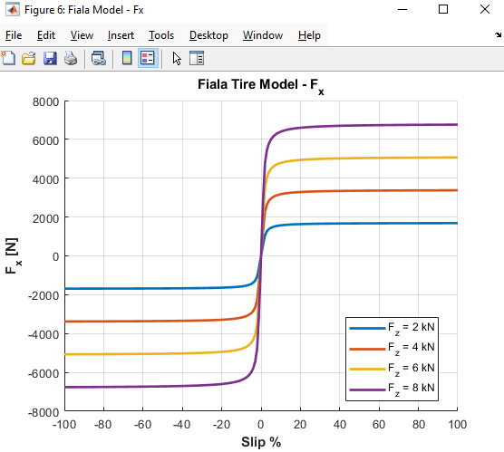
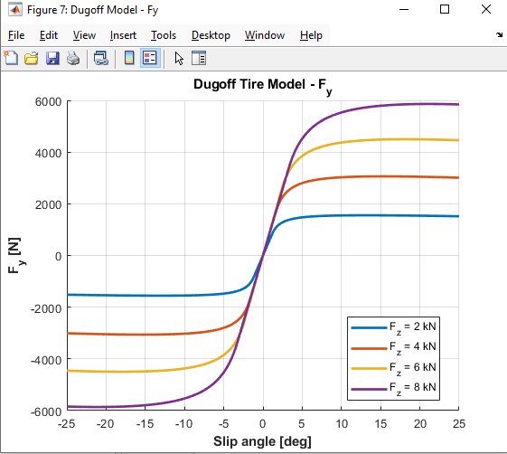
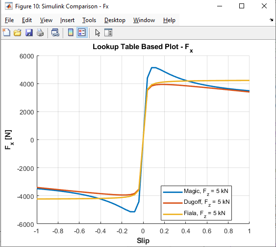
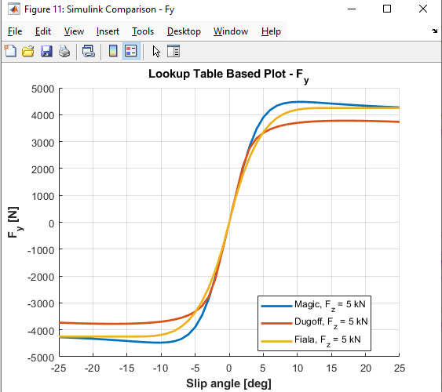

# Tire Modeling & Dynamics Simulation 🏎️

This repository contains the MATLAB and Simulink implementations for vehicle tire modeling, developed as part of the MKT4834 Introduction to Vehicle Dynamics course. 

The project investigates the behavior of tires under various slip conditions using different mathematical and physical tire models, culminating in a combined slip friction ellipse (Carpet Plot).

## 📌 Implemented Tire Models
1. **Magic Formula (Bakker et al., 1987):** Empirical model used to derive baseline tire stiffness values ($C_s$ and $C_\alpha$).
2. **Fiala Tire Model:** Physical model evaluating the transition from elastic grip to pure sliding.
3. **Dugoff Tire Model:** Advanced physical model incorporating dynamic friction reduction and combined slip conditions.

## 🛠️ Project Architecture
* `HW2_TireModels.m`: The core MATLAB script. It calculates the longitudinal ($F_x$), lateral ($F_y$), and aligning torque ($M_z$) for all models across varying vertical loads ($F_z$). It also prepares and exports the structured 2-D data matrices to the Workspace.
* `HW2_2106A503_IVD.slx`: The Simulink architecture utilizing **2-D Lookup Tables** to map the slip and vertical load inputs to the generated tire forces in real-time.

## 📊 Key Results & Showcases

### Combined Slip & Friction Ellipse (Carpet Plot)
Using the Dugoff model, the interaction between longitudinal and lateral forces under a constant vertical load ($F_z = 4000$ N) is plotted against the theoretical friction limit ($\mu \cdot F_z$).

### Simulink 2-D Lookup Table Surfaces (Mesh)
The structured data fed into Simulink is visualized as 3D mesh surfaces, representing the tire behavior across the full range of slip and vertical loads.
| Dugoff Fx Mesh | Fiala Fy Mesh |
| :---: | :---: |
|  |  |

### Pure Slip Dynamics
*Comparison of tire forces and aligning moments across different models:*
| Magic Formula Mz | Fiala Fx | Dugoff Fy |
| :---: | :---: | :---: |
|  |  |  |

### Simulink Lookup Table Validation
*Comparison between MATLAB calculated values and Simulink Lookup Table outputs:*
| Fx Validation | Fy Validation |
| :---: | :---: |
|  |  |

---
*Developed for MKT4834 Introduction to Vehicle Dynamics - Spring 2026*
